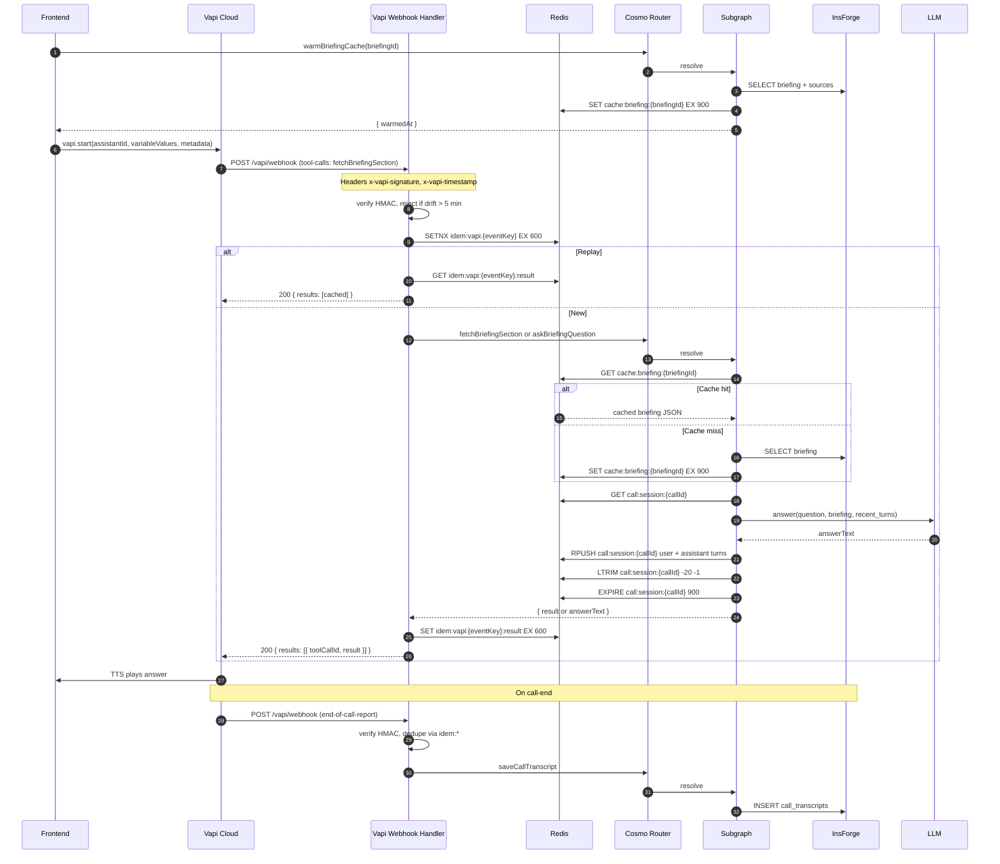

**Created At**: 2026-04-24
**Author**: spec-principal-writer-01
**Approved By**: [leave blank]

> **Preamble**. Slice owner: Dev C. Depends on Phase 0 + fixture row. **Does not depend on Dev B's briefing pipeline** — the fixture row unblocks Dev C from hour zero per master §8.2 artifact 10.
>
> **Cross-references**: [../../IDEA.md](../../IDEA.md) · [../../CLAUDE.md](../../CLAUDE.md) · [00-master.md](./00-master.md).
>
> **Simplification pass (2026-04-24)** — authoritative concepts live in [00-master.md](./00-master.md):
>
> - `fetchBriefingSection` + `askBriefingQuestion` are **collapsed** into one operation `answerFromBriefing({ briefingId, mode: "question" | "section", input, callId })`. Vapi binds two tool definitions (`fetchBriefingSection`, `askBriefingQuestion`) to this single operation. Below, any handler or file path referencing the old split names maps to this single operation.
> - `warmBriefingCache` is **removed**. Cache is populated on the first `getBriefing` read — the viewer fetches the briefing before `vapi.start()`, so Redis is warm by the time tool-calls land. Below, any `warmBriefingCache` step can be replaced by an unconditional `getBriefing(briefingId)` call in the viewer render path.
> - Docker-compose is now a single file with `profiles: ["test"]`; test-specific services spawn via `docker compose --profile test up -d`.

---

## 1. Problem

**Casual**: After the briefing is generated, the user wants to talk to an agent that already knows this meeting — hear the 60-second summary, ask "what should I ask first?", "draft a follow-up email", "give me a 30-second version". Today, opening a briefing and talking to a general assistant requires the user to paste the context every time.

**Formal**:

1. No voice agent holds briefing context for a specific meeting across turns.
2. No secure webhook layer accepts Vapi events with HMAC verification + replay protection.
3. No idempotent dedupe layer prevents Vapi retries from producing inconsistent answers.
4. No short-term session memory threads multiple questions in one call.
5. No persistence captures the transcript of a briefing conversation for audit + replay.

**Out of Scope**:

- **General-assistant chat**: the agent only answers about the current meeting briefing.
- **Multi-meeting context**: one briefing per call.
- **Voice authentication**: the call inherits the user's browser session.
- **Call recording storage in InsForge**: link the Vapi recording URL only.
- **Streaming LLM answers**: one answer per tool call, full text returned.

## 2. Solution

The main parts:

1. **Vapi permanent assistant** — one-time provisioned; `VAPI_ASSISTANT_ID` in env. System prompt + firstMessage templated with `{{briefing_summary}}`, `{{meeting_title}}`, `{{person_name}}`, `{{company_name}}`.
2. **Browser launcher** — frontend calls `vapi.start(assistantId, { variableValues, metadata: { briefingId, userId, source: "web" } })` so Vapi echoes metadata on every webhook.
3. **Vapi Webhook Handler** (`apps/vapi-webhook`) — Chainguard distroless Hono service on `:8787` with `POST /vapi/webhook`. HMAC + idem middleware, type-switch on `message.type`.
4. **`fetchBriefingSection` tool** — Vapi tool definition whose `briefingId` is statically injected from metadata (invisible to the LLM).
5. **Subgraph resolvers** — `askBriefingQuestion`, `fetchBriefingSection`, `draftFollowUpEmail`, `saveCallTranscript`, `warmBriefingCache`. All read from InsForge + Redis.
6. **Pre-warm cache** — `warmBriefingCache(briefingId)` on `vapi.start()` so tool-calls hit Redis, not InsForge (<250 ms p95).
7. **Session memory** — `call:session:{callId}` list (last 20 turns, 15-min TTL).

### Trade-off: briefing injection strategy

| Approach | Pros | Cons | Decision |
|---|---|---|---|
| Full briefing in system prompt via `variableValues` | Zero tool-call latency for facts | Blows token budget; needs re-start to update | Rejected alone |
| Tool-call only (empty system context) | Clean, small prompt | Every question hits a tool → audible latency | Rejected alone |
| Condensed summary inline + tool for depth | Fast happy path, flexible depth | Extra system-prompt tokens | **Chosen** |

## 3. Architecture



Owned services:

- **Vapi Webhook Handler** (`apps/vapi-webhook`) — Chainguard distroless.
- **Subgraph voice resolvers** (`apps/graph/src/resolvers/voice.ts`).

## 4. Components

+++ #### Vapi assistant provisioning (one-shot, PR #1)

`apps/vapi-webhook/scripts/provision-assistant.ts`

```typescript
function provisionAssistant(): Promise<{
  assistantId: string;
  fetchBriefingSectionToolId: string;
}>;
```

Body posted to `POST https://api.vapi.ai/assistant`:

```json
{
  "name": "PreCall Briefing Agent",
  "firstMessage": "Hey, ready to talk about {{meeting_title}}? I've got the briefing on {{person_name}} from {{company_name}}. Want the 60-second summary?",
  "firstMessageMode": "assistant-speaks-first",
  "model": {
    "provider": "openai",
    "model": "gpt-4o",
    "messages": [
      {
        "role": "system",
        "content": "You are PreCall, a meeting prep voice assistant. Meeting: {{meeting_title}} with {{person_name}} from {{company_name}}. Briefing summary: {{briefing_summary}}. Answer only about this meeting. Keep answers under 30 seconds. Use fetchBriefingSection for depth."
      }
    ],
    "toolIds": ["<fetchBriefingSectionToolId>"]
  },
  "voice": { "provider": "11labs", "voiceId": "21m00Tcm4TlvDq8ikWAM" },
  "transcriber": { "provider": "deepgram", "model": "nova-2", "language": "en" },
  "server": {
    "url": "https://api.precall.dev/vapi/webhook",
    "credentialId": "<hmac credential id>"
  },
  "serverMessages": ["tool-calls", "end-of-call-report", "status-update"]
}
```

`fetchBriefingSection` tool body posted to `POST https://api.vapi.ai/tool`:

```json
{
  "type": "function",
  "function": {
    "name": "fetchBriefingSection",
    "description": "Return a specific section of the current meeting briefing.",
    "parameters": {
      "type": "object",
      "properties": {
        "section": {
          "type": "string",
          "enum": ["summary", "questions", "opening_line", "pain_points", "notion_context", "follow_up_email", "risks"]
        }
      },
      "required": ["section"]
    }
  },
  "messages": [{ "type": "request-start", "content": "One sec..." }]
}
```

Post-provisioning, the returned `tool.id` is attached to the assistant's `model.toolIds` and `briefingId` is injected via Vapi **static parameters** on the tool (hard-merged into arguments, invisible to the LLM) sourced from `call.metadata.briefingId`.

+++

+++ #### Browser launcher (`apps/web/src/components/CallButton.tsx`, consumed by Dev D)

```typescript
interface CallButtonProps {
  briefingId: BriefingId;
}

async function startCall(briefingId: BriefingId, briefing: Briefing): Promise<void> {
  await precallClient.warmBriefingCache({ briefingId });
  const vapi = new Vapi(process.env.NEXT_PUBLIC_VAPI_PUBLIC_KEY!);
  await vapi.start(process.env.NEXT_PUBLIC_VAPI_ASSISTANT_ID!, {
    variableValues: {
      meeting_title: briefing.meetingTitle,
      person_name: briefing.contactName,
      company_name: briefing.companyName,
      briefing_summary: briefing.summary60s,
    },
    metadata: { briefingId, userId: briefing.userId, source: "web" },
  });
}
```

Public key in client; private key **never** leaves the server.

+++

+++ #### Vapi Webhook Handler (`apps/vapi-webhook/src/index.ts`)

Hono server on `:8787`. Routes:

- `POST /vapi/webhook` — signature + idem middleware, type-switch handler.
- `GET /health` — returns `{ "status": "ok" }` for the Chainguard healthcheck.

+++

+++ #### HMAC middleware (`apps/vapi-webhook/src/middleware/hmac.ts`, PR #2)

```typescript
interface HmacMiddlewareConfig {
  secret: string; // VAPI_WEBHOOK_SECRET
  headerName: string; // "x-vapi-signature"
  timestampHeaderName: string; // "x-vapi-timestamp"
  maxSkewMs: number; // 300_000 (5 min per CLAUDE.md)
}

function verifyVapiSignature(
  rawBody: string,
  headers: Headers,
  config: HmacMiddlewareConfig
): { ok: true } | { ok: false; reason: string };
```

Implementation lives in `apps/vapi-webhook/src/middleware/hmac.ts`:

```typescript
import { createHmac, timingSafeEqual } from "node:crypto";

export function verifyVapiSignature(rawBody, headers, config) {
  const sig = headers.get(config.headerName);
  const tsHeader = headers.get(config.timestampHeaderName);
  if (!sig || !tsHeader) return { ok: false, reason: "missing_headers" };
  const ts = Number(tsHeader);
  if (!Number.isFinite(ts)) return { ok: false, reason: "bad_timestamp" };
  if (Math.abs(Date.now() - ts) > config.maxSkewMs) return { ok: false, reason: "replay_window" };
  const expected = createHmac("sha256", config.secret).update(`${tsHeader}.${rawBody}`).digest("hex");
  const expectedBuf = Buffer.from(expected, "hex");
  const actualBuf = Buffer.from(sig, "hex");
  if (expectedBuf.length !== actualBuf.length) return { ok: false, reason: "length_mismatch" };
  if (!timingSafeEqual(expectedBuf, actualBuf)) return { ok: false, reason: "signature_mismatch" };
  return { ok: true };
}
```

On `ok: false` → respond 401. Vapi will retry; retry will fail verification the same way, which is correct.

+++

+++ #### Idem middleware (`apps/vapi-webhook/src/middleware/idem.ts`, PR #2)

```typescript
function claimIdempotency(envelope: VapiWebhookEnvelope, redis: RedisClientType):
  Promise<{ fresh: true } | { fresh: false; cachedResult: unknown | null }>;

function cacheIdempotencyResult(envelope: VapiWebhookEnvelope, result: unknown, redis: RedisClientType):
  Promise<void>;
```

Key composition:

```typescript
function eventKey(envelope: VapiWebhookEnvelope): string {
  const { call, type, timestamp, toolCallList } = envelope.message;
  const parts = [call.id, type, String(timestamp)];
  if (type === "tool-calls" && toolCallList && toolCallList[0]) parts.push(toolCallList[0].id);
  return `idem:vapi:${parts.join(":")}`;
}
```

Claim:

```typescript
const claimed = await redis.set(eventKey(envelope), "1", { NX: true, EX: 600 });
if (claimed === null) {
  const cached = await redis.get(`${eventKey(envelope)}:result`);
  return { fresh: false, cachedResult: cached ? JSON.parse(cached) : null };
}
return { fresh: true };
```

Cache after processing tool-calls:

```typescript
await redis.set(`${eventKey(envelope)}:result`, JSON.stringify(result), { EX: 600 });
```

+++

+++ #### Webhook route (`apps/vapi-webhook/src/routes/webhook.ts`, PR #3)

```typescript
type WebhookResponse =
  | { status: 200; body: { results: Array<{ toolCallId: string; result: string }> } }
  | { status: 200; body: {} };

function handleWebhook(envelope: VapiWebhookEnvelope, ctx: RouteContext): Promise<WebhookResponse>;
```

Type switch:

- `"tool-calls"` → extract `toolCallList`; for each tool-call, dispatch via `toolHandlers`; return `{ results: [...] }`.
- `"end-of-call-report"` → dispatch `saveCallTranscript`; return `{}`.
- `"status-update"` → optional Redis write (`call:session:{callId}:status`); return `{}`.

Tool dispatch table (tool names match subgraph operation names; no `handle*` wrappers):

```typescript
const toolHandlers: Record<string, ToolHandler> = {
  fetchBriefingSection: callFetchBriefingSection,
  askBriefingQuestion: callAskBriefingQuestion,
  draftFollowUpEmail: callDraftFollowUpEmail,
};

type ToolHandler = (
  args: Record<string, unknown>,
  envelope: VapiWebhookEnvelope,
  ctx: RouteContext
) => Promise<string>;
```

Each dispatcher calls the Subgraph via the generated client with a service-account JWT.

+++

+++ #### Subgraph voice resolvers (`apps/graph/src/resolvers/voice.ts`)

```typescript
function warmBriefingCache(
  input: { briefingId: BriefingId },
  ctx: GraphContext
): Promise<{ warmedAt: number }>;

function askBriefingQuestion(
  input: { briefingId: BriefingId; question: string; callId: string },
  ctx: GraphContext
): Promise<{ answerText: string }>;

function fetchBriefingSection(
  input: { briefingId: BriefingId; section: BriefingSectionKey; callId: string },
  ctx: GraphContext
): Promise<{ result: string }>;

function draftFollowUpEmail(
  input: { briefingId: BriefingId; tone?: "neutral" | "warm" | "direct" },
  ctx: GraphContext
): Promise<{ emailText: string }>;

function saveCallTranscript(
  input: {
    briefingId: BriefingId;
    vapiCallId: string;
    transcript: unknown;
    recordingUrl?: string;
    startedAt: string;
    endedAt: string;
  },
  ctx: GraphContext
): Promise<{ transcriptId: TranscriptId }>;

type BriefingSectionKey =
  | "summary"
  | "questions"
  | "opening_line"
  | "pain_points"
  | "notion_context"
  | "follow_up_email"
  | "risks";

interface VoiceTurn {
  role: "user" | "assistant";
  text: string;
  at: number; // unix ms
}
```

+++

+++ #### `BriefingSectionKey` → `BriefingSections` mapping (canonical)

This table is the single source of truth for the wire enum / struct-field mapping. Subspec 01 §4.7 (`BriefingSections`) cross-references it.

| Wire key (`BriefingSectionKey`) | Struct field (`BriefingSections`) | Example output |
|---|---|---|
| `summary` | `summary60s` | 60-second spoken-ready summary |
| `questions` | `questionsToAsk` | Numbered list of exactly 5 questions |
| `opening_line` | `suggestedOpeningLine` | Single sentence |
| `pain_points` | `likelyPainPoints` | Numbered list (3–5 items) |
| `notion_context` | `internalContext.notionExcerpts` | Concatenated excerpts with page-title attribution |
| `follow_up_email` | `followUpEmail` | Draft email text |
| `risks` | `risks` | Joined with "; " |

+++

+++ #### `fetchBriefingSection` handler

Resolves a wire key to a string suitable for TTS. Every section string stays under 800 characters (spoken under 45 s).

+++

+++ #### `askBriefingQuestion` handler

```typescript
async function askBriefingQuestion(
  input: { briefingId: BriefingId; question: string; callId: string },
  ctx: GraphContext
): Promise<{ answerText: string }> {
  const briefing = await loadBriefingCached(ctx, input.briefingId);
  const turns = await loadSessionTurns(ctx, input.callId);
  const answer = await ctx.services.llm.answerQuestion({
    briefing,
    question: input.question,
    recentTurns: turns,
  });
  await pushTurn(ctx, input.callId, { role: "user", text: input.question, at: Date.now() });
  await pushTurn(ctx, input.callId, { role: "assistant", text: answer.text, at: Date.now() });
  return { answerText: answer.text };
}

async function pushTurn(ctx: GraphContext, callId: string, turn: VoiceTurn): Promise<void> {
  const key = `call:session:${callId}`;
  await ctx.redis.rPush(key, JSON.stringify(turn));
  await ctx.redis.lTrim(key, -20, -1);
  await ctx.redis.expire(key, 900);
}
```

LLM config: `gpt-4o`, temperature 0.4, max tokens 300 (answers under 30 s spoken), non-streaming.

+++

+++ #### `saveCallTranscript` handler

Writes `call_transcripts` row from `end-of-call-report`'s `artifact`:

```typescript
interface EndOfCallArtifact {
  transcript: string;
  recording?: { recordingUrl: string };
  messages: unknown[];
}
```

Row population (TS DTO fields → DB columns):

- `vapiCallId` → `vapi_call_id` ← `call.id`.
- `briefingId` → `briefing_id` ← `call.metadata.briefingId`.
- `userId` → `user_id` ← `call.metadata.userId`.
- `transcript` → `transcript` ← `artifact.messages` (turn-by-turn JSONB).
- `recordingUrl` → `recording_url` ← `artifact.recording?.recordingUrl ?? null`.
- `startedAt` → `started_at`, `endedAt` → `ended_at` ← from envelope fields.

+++

## 5. Data Flow

1. **Launch** — Frontend calls `warmBriefingCache(briefingId)` → Subgraph reads `briefings` + `sources` from InsForge, `SET cache:briefing:{briefingId} EX 900`. Then `vapi.start()` with metadata.
2. **First turn** — Vapi POSTs `tool-calls`. Handler:
   - HMAC verify using `x-vapi-signature` + `x-vapi-timestamp`.
   - Idem claim via `SETNX idem:vapi:{eventKey} EX 600`.
   - If replay → return 200 with cached `idem:vapi:{eventKey}:result`.
   - Dispatch to Subgraph.
   - Subgraph reads `cache:briefing:{briefingId}` (miss → InsForge fallback), `call:session:{callId}`, calls LLM, writes turns back, returns `{ result | answerText }`.
   - Handler caches result, returns 200 `{ results: [{ toolCallId, result }] }`.
3. **Subsequent turns** — Same as step 2, session memory grows to last 20 turns.
4. **End-of-call** — Vapi POSTs `end-of-call-report`. Handler dispatches `saveCallTranscript`. InsForge row written. Return 200 `{}`.

**Keys referenced** (all defined in master §4 Redis inventory):

- `cache:briefing:{briefingId}` — 900 s, Subgraph writer.
- `call:session:{callId}` — 900 s, LIST, last 20 turns.
- `idem:vapi:{eventKey}` + `idem:vapi:{eventKey}:result` — 600 s, webhook handler writer.

**Latency budget**: <5 s hard ceiling per Vapi webhook response, <250 ms p95 target.

## 6. API Contracts

+++ #### POST /vapi/webhook

| Auth | Request | Response | Status codes |
|---|---|---|---|
| HMAC-SHA256 | `VapiWebhookEnvelope` | Tool-calls: `{ results: [...] }` · Async events: `{}` | 200 (always on valid HMAC), 401 (HMAC failure) |

Request envelope defined in master §4 Vapi Webhook Handler block.

Required headers:

- `x-vapi-signature`: lowercase hex HMAC-SHA256 of `${x-vapi-timestamp}.${rawBody}` using `VAPI_WEBHOOK_SECRET`.
- `x-vapi-timestamp`: unix milliseconds. Rejected if `|now - ts| > 300000`.

**Invariant**: never 4xx on duplicate event. Vapi retries on non-2xx; returning 200 with cached result stops the retry and keeps the conversation deterministic.

+++

+++ #### POST https://api.vapi.ai/assistant

Provisioning only. Body in §4 above.

+++

+++ #### POST https://api.vapi.ai/tool

Provisioning only. Body in §4 above.

+++

+++ #### Named subgraph operations

`apps/graph/operations/`:

- `warmBriefingCache.graphql`
- `askBriefingQuestion.graphql`
- `fetchBriefingSection.graphql`
- `draftFollowUpEmail.graphql`
- `saveCallTranscript.graphql`

All consumed by the Webhook Handler via the generated Cosmo client, not hand-coded GraphQL. Input/output signatures live in master §4 operation inventory table.

+++

## 7. Test Plan

| Component | Test type | Deps (real/stub) | Observable assertion | Speed |
|---|---|---|---|---|
| HMAC verifier | Unit | None | (a) valid sig + ts → `ok: true`; (b) wrong sig → `signature_mismatch`; (c) drift 6 min → `replay_window`; (d) missing headers → `missing_headers`. | <1s |
| Idem middleware | Integration | Real Redis | First claim → `fresh: true`. Second same-key → `fresh: false`. Cached result returned on replay. | <1s |
| Webhook route — tool-calls | Integration | Real Redis + stubbed Subgraph | `fetchBriefingSection(section: "summary")` returns `summary60s` from fixture. `toolCallId` echoed exactly. | <2s |
| Webhook route — replay | Integration | Real Redis | Same envelope twice → identical response body; Subgraph called once. | <2s |
| Webhook route — end-of-call | Integration | Real Redis + Postgres | `call_transcripts` row written with `vapi_call_id`, `transcript`, `recording_url`. | <2s |
| `warmBriefingCache` | Integration | Real Redis + Postgres | `cache:briefing:{id}` set with TTL 900 s. | <1s |
| `askBriefingQuestion` | Integration | Real Redis + Postgres, stubbed LLM | Answer returned; 2 turns added to `call:session:{callId}`. | <2s |
| Session memory trim | Unit | Real Redis | After 25 pushes, list length = 20. | <1s |
| End-to-end fixture Q&A | Integration | Real Redis + Postgres + fixture + stubbed Vapi + stubbed LLM | Fake `tool-calls` envelope (valid HMAC) for `fetchBriefingSection("summary")` on fixture briefing → 200 with correct summary text. | <3s |
| Latency p95 | Integration (perf) | Real Redis + warm cache | 95th percentile of 100 `fetchBriefingSection` calls <250 ms. | <30s |

All tests under `apps/vapi-webhook/tests/` and `apps/graph/tests/voice/`.

## 8. Rollout

### 8.0 Rollout summary

- **Branch**: `feat/voice-qa`.
- **Deploy order**: Webhook Handler service first (needs public HTTPS for Vapi); voice resolvers ship with Subgraph.
- **Feature flag**: none.
- **Migration**: none beyond Phase 0 (`call_transcripts` is in `001_init.sql`).
- **Rollback**: per-PR revert. HMAC middleware is isolated; failure there blocks only the webhook, not other slices.

Depends on Phase 0 artifacts 13 (fixture), 16 (operations), 18 (webhook skeleton). **Does not depend on Dev B.**

### 8.1 PR sequence

| # | PR | Depends on | Owner |
|---|---|---|---|
| 1 | `feat/vapi-assistant-provisioning` — one-shot provision script | Phase 0 | Dev C |
| 2 | `feat/hmac-idem-middleware` — middleware + unit tests | Phase 0 | Dev C |
| 3 | `feat/fetchBriefingSection` — subgraph resolver + webhook dispatch wired to fixture | #2 | Dev C |
| 4 | `feat/askBriefingQuestion` — subgraph resolver + session memory | #3 | Dev C |
| 5 | `feat/warmBriefingCache` — pre-warm + `CallButton` hook | #3 | Dev C |
| 6 | `feat/saveCallTranscript` — end-of-call handler | #2 | Dev C |
| 7 | `feat/draftFollowUpEmail` — optional; cuts if time short | #3 | Dev C (cut list) |

### 8.2 Wall-clock plan (11:00–16:30 PT, 2026-04-24)

| Time | Work | PR(s) | Exit criteria |
|---|---|---|---|
| 12:00 | Rebase on `feat/phase-0-foundations` | — | `pnpm typecheck` green |
| 12:00–12:20 | Vapi assistant + tool provisioning | #1 | `VAPI_ASSISTANT_ID` in env; dashboard shows assistant |
| 12:20–13:00 | HMAC + idem middleware + unit tests | #2 | All unit tests green |
| 13:00–14:00 | `fetchBriefingSection` end-to-end against fixture | #3 | Real Vapi web call returns "summary" section aloud |
| 14:00–14:30 | `askBriefingQuestion` + `warmBriefingCache` | #4, #5 | Follow-up question answered with briefing context |
| 14:30–15:00 | `saveCallTranscript` on end-of-call | #6 | Transcript row in InsForge after a real call |
| 15:00–16:00 | Bug fixing + voice tuning + pre-record backup take | — | Demo-ready |

### 8.3 Cut list (if slipping at 14:00 PT)

1. Drop `draftFollowUpEmail` tool; keep `fetchBriefingSection` + `askBriefingQuestion`. Agent reads pre-generated `follow_up_email` via `fetchBriefingSection("follow_up_email")`.
2. Drop `warmBriefingCache`; Subgraph reads InsForge on every call. Adds ~100 ms, still under 5 s ceiling.
3. Drop `saveCallTranscript`; document as stretch in implementation log.

## 9. Open Questions

1. **[RESOLVED] HMAC vs Bearer shortcut.** HMAC per CLAUDE.md mandate. Header `x-vapi-signature`, payload `${timestamp}.${raw_body}`, 5-min replay window.

2. **[RESOLVED] Briefing context injection.** Both: condensed summary in `variableValues` + `fetchBriefingSection` tool for depth.

3. **[RESOLVED] Call recording storage.** Link Vapi `recordingUrl` in `call_transcripts.recording_url`; no proxy-download.

4. **[RESOLVED] Session memory size.** Last 20 turns, 15-min TTL. `LTRIM -20 -1`.

5. **[RESOLVED] Static `briefingId` injection.** Via Vapi static-parameter mechanism on the tool; sourced from `call.metadata.briefingId`. Invisible to the LLM.

6. **[RESOLVED] Service auth from Webhook Handler to Cosmo Router.** Service-account JWT minted at startup from `INSFORGE_ADMIN_EMAIL` / `INSFORGE_ADMIN_PASSWORD`. Rotated per deploy.

7. **[RESOLVED] `BriefingSectionKey` ↔ `BriefingSections` mapping.** Canonical table in §4.

8. **[DEFERRED — post-MVP]** Streaming LLM answers. Non-streaming is simpler and meets the 5 s ceiling.

9. **[DEFERRED — post-MVP]** Multi-briefing context switch mid-call. One briefing per call.

10. **[NON_BLOCKING]** Voice choice: 11labs voice `21m00Tcm4TlvDq8ikWAM` (Rachel). Owner: Dev C. Deadline: 14:30 PT. Swap if a better free-tier match is available.

11. **[NON_BLOCKING]** STT model: Deepgram `nova-2` for lowest latency. Owner: Dev C. Deadline: 14:30 PT. Switch to `nova-3` only if dashboard confirms it is free on the assistant's STT quota.

12. **[NON_BLOCKING]** Tool `messages: [{ type: "request-start" }]` filler copy. Owner: Dev C. Deadline: 15:30 PT (polish pass).
