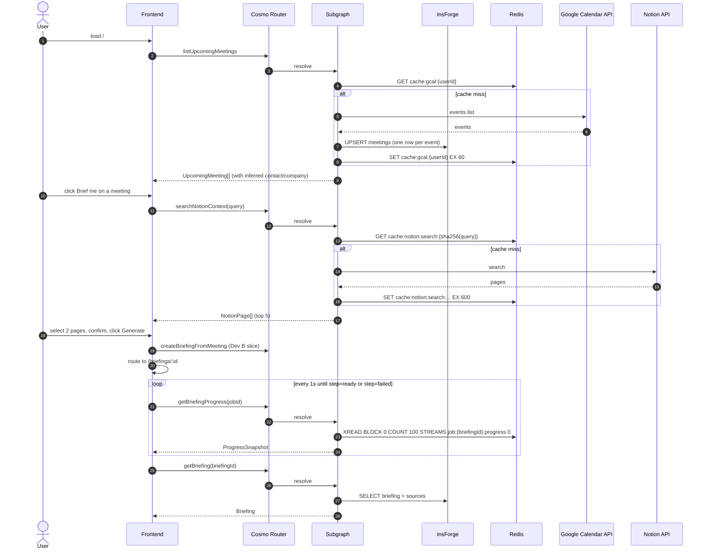

**Created At**: 2026-04-24
**Author**: spec-principal-writer-01
**Approved By**: [leave blank]

> **Preamble**. Slice owner: Dev D. Depends on Phase 0. Frontend + Google Calendar + Notion + read-path resolvers.
>
> **Cross-references**: [../../IDEA.md](../../IDEA.md) · [../../CLAUDE.md](../../CLAUDE.md) · [00-master.md](./00-master.md).
>
> **Simplification pass (2026-04-24)** — authoritative Redis inventory + operations live in [00-master.md](./00-master.md):
>
> - **`cache:gcal:{userId}` is removed.** The `listUpcomingMeetings` resolver calls Google Calendar directly on every request. Cache savings are marginal at 60s TTL and the Redis sponsor narrative still has 4 other cache use cases.
> - **`warmBriefingCache` operation is removed.** The viewer calls `getBriefing(briefingId)` to render the 11-section layout; the resolver populates `cache:briefing:{briefingId}` on that read. By the time the user clicks "Call briefing agent" and `vapi.start()` fires, the cache is warm. No separate pre-warm step.
> - **`GCalClient` lives at `packages/integrations/src/gcal.ts`** (not `packages/gcal/`). Same interface.
> - **Briefings denormalize contact + company** — `briefings.contact_name`, `briefings.company_name`, etc. `BriefingListItem.companyName` reads directly from `briefings.company_name` (no join).

---

## 1. Problem

**Casual**: The user needs one screen that shows their next few meetings, lets them click "Brief me", lets them pick the right Notion pages, shows progress while research runs, and then renders the finished briefing with a "Call briefing agent" button. They also want to see recent briefings. No login juggling, no typing company names.

**Formal**:

1. No dashboard lists upcoming calendar meetings with inferred company + contact metadata.
2. No Notion search surface lets the user select 1–3 relevant pages.
3. No progress UI narrates the research pipeline in real time.
4. No briefing viewer renders the 11-section output with inline source links.
5. No recent-briefings list gives users a way back to past briefings.
6. No OAuth glue for Google Calendar + Notion exists.

**Out of Scope**:

- **Writing events / pages**: read-only integrations.
- **Calendar background sync**: read on demand.
- **Email integrations, CRM views, admin settings**: banned per master §1.
- **Offline mode**: demo is always online.
- **Mobile responsiveness beyond baseline**: desktop demo.
- **Dark mode**: not MVP.

## 2. Solution

The main parts:

1. **Dashboard page** (`/`) — upcoming meetings list, recent briefings list, manual "Create briefing" button.
2. **Briefing composer page** (`/meetings/:id/brief`) — inferred metadata editor + Notion page picker + "Generate" button.
3. **Progress view** (`/briefings/:id` while status ∈ `pending`/`researching`/`drafting`) — polls `getBriefingProgress`, renders step + pct.
4. **Briefing viewer page** (`/briefings/:id` when `status = 'ready'`) — 11 sections rendered; "Call briefing agent" launcher.
5. **Recent briefings list** — `listBriefings` bottom panel on dashboard.
6. **Google Calendar adapter** — read-only; cached in `cache:gcal:{userId}` for 60 s.
7. **Notion adapter** — search + page read; cached per `cache:notion:*`.

### Trade-off: progress UI transport

| Approach | Pros | Cons | Decision |
|---|---|---|---|
| GraphQL subscription over `XREAD BLOCK` | Push-based, zero polling | Frontend ws plumbing; Cosmo subscriptions need extra config | Stretch only |
| 1-second polling of `getBriefingProgress` Q, resolver replays Stream from `id=0` each poll | Stream replay on every poll | Slightly more server work | **Chosen** |

## 3. Architecture



Owned services:

- **Frontend** (`apps/web`) — Next.js 14 App Router.
- **Meeting + Notion + GCal resolvers** (`apps/graph/src/resolvers/meeting.ts`).

## 4. Components

+++ #### Dashboard page (`apps/web/src/app/page.tsx`, PR #5)

```typescript
interface DashboardData {
  upcomingMeetings: UpcomingMeeting[];
  recentBriefings: BriefingListItem[];
}

async function loadDashboard(userId: UserId): Promise<DashboardData>;
```

Layout:

- Top: "Today" + "Tomorrow" sections showing up to 5 meetings each.
- Each meeting row: title, start time, attendees (first 3 + count), inferred company, "Brief me" button.
- Bottom: "Recent briefings" with title, company, created-at, status badge.

+++

+++ #### Briefing composer page (`apps/web/src/app/meetings/[meetingId]/brief/page.tsx`, PR #6)

```typescript
interface BriefingComposerState {
  meeting: UpcomingMeeting;
  inferredContactName: string;
  inferredCompanyName: string;
  inferredCompanyDomain: string | null;
  notionQuery: string;
  notionResults: NotionPage[];
  selectedPageIds: NotionPageId[];
}
```

UX:

1. Show inferred contact + company; let user edit either.
2. Show Notion search results (top 5). Default query = `${contactName} ${companyName}`.
3. User selects 1–3 pages via checkboxes.
4. Click "Generate briefing" → calls `createBriefingFromMeeting` → navigates to `/briefings/:id`.

+++

+++ #### Progress view (`apps/web/src/app/briefings/[briefingId]/page.tsx` while `status !== 'ready'`, PR #7)

```typescript
interface ProgressViewState {
  briefingId: BriefingId;
  jobId: JobId;
  current: ProgressEvent;
  history: ProgressEvent[];
}
```

`ProgressEvent`, `ProgressStep` types are canonical in `packages/schema/src/jobs.ts` (master §4). `ProgressStep` values: `"queued" | "searching_notion" | "researching_company" | "reading_pages" | "synthesizing" | "ready" | "failed"`.

UX: vertical checklist. Each step lights up when seen in the stream. `detail` (e.g. "Reading Ramp pricing page") renders under the active step. Polling interval 1 s; stop on `step === "ready"` or `step === "failed"`.

+++

+++ #### Briefing viewer (`apps/web/src/app/briefings/[briefingId]/page.tsx` while `status === 'ready'`, PR #8)

Renders the 11-section briefing from `briefings.sections`:

- 60-second summary banner at top (`BriefingSections.summary60s`).
- Accordion-style sections for the rest.
- "Call briefing agent" button wires into the voice-qa slice via `CallButton` component (owned by Dev C, imported here).
- Sources list at bottom with clickable URLs.

+++

+++ #### Recent briefings (`apps/web/src/components/RecentBriefings.tsx`, PR #9)

Calls `listBriefings` on dashboard load. Shows up to 10 briefings with:

- Title (`meetings.title` or "Manual briefing").
- Company name.
- Status badge — green = `ready`, yellow = `pending` / `researching` / `drafting`, red = `failed`.
- Created-at relative (e.g. "12 min ago").

`BriefingListItem` type is canonical in `packages/schema/src/briefing.ts` (master §4).

+++

+++ #### Meeting + Notion + GCal resolvers (`apps/graph/src/resolvers/meeting.ts`)

```typescript
function listUpcomingMeetings(
  input: { userId: UserId; limit?: number },
  ctx: GraphContext
): Promise<UpcomingMeeting[]>;

function searchNotionContext(
  input: { userId: UserId; query: string },
  ctx: GraphContext
): Promise<NotionPage[]>;

function getBriefingProgress(
  input: { jobId: JobId; since?: string },
  ctx: GraphContext
): Promise<ProgressSnapshot>;

function getBriefing(
  input: { briefingId: BriefingId },
  ctx: GraphContext
): Promise<Briefing>;

function listBriefings(
  input: { userId: UserId; limit?: number },
  ctx: GraphContext
): Promise<BriefingListItem[]>;

interface UpcomingMeeting {
  id: MeetingId;
  title: string;
  startsAt: string; // ISO-8601
  attendees: Array<{ email: string; displayName?: string }>;
  description?: string;
  inferred: { contactName?: string; companyName?: string; companyDomain?: string };
}

interface NotionPage {
  id: NotionPageId;
  title: string;
  snippet: string;
  url: string;
}
```

+++

+++ #### Google Calendar adapter (`packages/gcal/src/client.ts`, PR #2)

```typescript
interface CalendarEvent {
  id: string;
  title: string;
  startsAt: string; // ISO-8601
  attendees: Array<{ email: string; displayName?: string; organizer?: boolean }>;
  description?: string;
  hangoutLink?: string;
  location?: string;
}

interface GCalClient {
  listUpcoming(input: { userId: UserId; limit: number }): Promise<CalendarEvent[]>;
}
```

OAuth scope: `https://www.googleapis.com/auth/calendar.readonly`. Refresh token stored on `users.google_refresh_token` (see master §4 DDL). Client uses `googleapis` npm.

Inference helper:

```typescript
const PERSONAL_DOMAINS: ReadonlySet<string> = new Set([
  "gmail.com", "googlemail.com", "icloud.com", "me.com", "outlook.com",
  "hotmail.com", "yahoo.com", "proton.me", "protonmail.com",
]);

function inferCompanyFromAttendees(
  attendees: CalendarEvent["attendees"],
  userEmail: string
): { contactName?: string; companyName?: string; companyDomain?: string } {
  const nonUser = attendees.filter((a) => a.email !== userEmail);
  const external = nonUser.find((a) => {
    const domain = a.email.split("@")[1]?.toLowerCase();
    return domain && !PERSONAL_DOMAINS.has(domain);
  });
  if (!external) return {};
  const domain = external.email.split("@")[1]!.toLowerCase();
  return {
    contactName: external.displayName,
    companyName: toTitleCase(domain.replace(/\.(com|io|ai|co|dev|org)$/, "")),
    companyDomain: domain,
  };
}
```

+++

+++ #### Notion adapter (`packages/notion/src/client.ts`, PR #4)

```typescript
interface NotionPageRead {
  id: NotionPageId;
  title: string;
  content: string; // plain text blocks joined
  lastEditedAt: string; // ISO-8601
}

interface NotionClient {
  search(input: { userId: UserId; query: string }): Promise<NotionPage[]>;
  readPage(input: { userId: UserId; pageId: NotionPageId }): Promise<NotionPageRead>;
}
```

OAuth via Notion's public OAuth 2.0. Scope: `read_content`. Token stored on `users.notion_token`.

+++

+++ #### Generated GraphQL client (`packages/sdk`, Phase 0 artifact)

```typescript
// Frontend + server consumers import:
import { precallClient } from "@precall/sdk";

precallClient.listUpcomingMeetings(input): Promise<UpcomingMeeting[]>;
precallClient.searchNotionContext(input): Promise<NotionPage[]>;
precallClient.createBriefingFromMeeting(input): Promise<{ briefingId; jobId; deduped }>;
precallClient.getBriefingProgress(input): Promise<ProgressSnapshot>;
precallClient.getBriefing(input): Promise<Briefing>;
precallClient.listBriefings(input): Promise<BriefingListItem[]>;
precallClient.warmBriefingCache(input): Promise<{ warmedAt: number }>;
```

Full operation inventory (input/output signatures) in master §4 Subgraph block. Generated via `wgc operations push`. Hackathon-acceptable fallback: hand-written typed wrappers around `fetch` with the same interface names.

+++

## 5. Data Flow

1. **Dashboard load** — Frontend calls `listUpcomingMeetings` + `listBriefings` in parallel. Subgraph resolves both; Calendar read goes through `cache:gcal:{userId}` (60 s TTL). `meetings` table upserted with `(user_id, calendar_event_id)` as unique key.
2. **Brief-me click** — Navigate to composer. `searchNotionContext` runs with default query or fallback `meeting.title`. Results cached in `cache:notion:search:{sha256(query)}` for 600 s.
3. **Generate** — `createBriefingFromMeeting` (Dev B slice). Frontend navigates to `/briefings/:id`.
4. **Progress polling** — `getBriefingProgress(jobId)` polled every 1 s. Subgraph reads `job:{briefingId}:progress` Stream from `id=0`, returns full `history[]` + latest `current`. Frontend renders the checklist.
5. **Briefing load** — When `current.step === "ready"`, frontend calls `getBriefing(briefingId)`. Subgraph reads `briefings` + `sources` from InsForge.
6. **Call launcher** — `CallButton` (imported from voice-qa slice) calls `warmBriefingCache` then `vapi.start()`.

**Keys referenced**:

- `cache:gcal:{userId}` — 60 s, Subgraph writer.
- `cache:notion:search:{sha256(query)}` — 600 s, Subgraph writer.
- `cache:notion:page:{pageId}` — 3600 s, Worker writer (shared with Dev B slice).
- `job:{briefingId}:progress` — 3600 s, Stream, Worker writes / Subgraph reads.

## 6. API Contracts

+++ #### Cosmo named operations

`apps/graph/operations/`:

- `listUpcomingMeetings.graphql`
- `searchNotionContext.graphql`
- `getBriefingProgress.graphql`
- `getBriefing.graphql`
- `listBriefings.graphql`

All called from frontend via generated client. Input/output types match §4 resolver signatures.

+++

+++ #### Google Calendar API

| Method | URL | Auth | Params | Response |
|---|---|---|---|---|
| GET | `https://www.googleapis.com/calendar/v3/calendars/primary/events` | `Bearer <google_access_token>` | `timeMin`, `timeMax`, `maxResults=20`, `singleEvents=true`, `orderBy=startTime` | Google Calendar v3 Event list |

Error model (per `errors` skill):

- `401` → token expired → refresh via `google_refresh_token`, retry once.
- `403` → permanent; surface `UserInputError("Calendar permission missing")`.
- `5xx` → transient; retry with backoff (max 2).

+++

+++ #### Notion API

| Method | URL | Auth | Request | Response |
|---|---|---|---|---|
| POST | `https://api.notion.com/v1/search` | `Bearer <notion_token>` + `Notion-Version: 2022-06-28` | `{ query, filter: { property: "object", value: "page" }, page_size: 10 }` | Notion search response |
| GET | `https://api.notion.com/v1/pages/{id}` | `Bearer <notion_token>` | — | Page object |
| GET | `https://api.notion.com/v1/blocks/{id}/children` | `Bearer <notion_token>` | `page_size=100` | Block children |

Error model:

- `401` → token expired → surface to user, require re-connect (no refresh token for Notion public OAuth).
- `429` → transient; backoff per `Retry-After`.
- `5xx` → transient.

+++

+++ #### OAuth callback routes

| Method | Path | Query params | Response | Purpose |
|---|---|---|---|---|
| GET | `/auth/google/callback` | `code`, `state` | 302 redirect to `/`; on error 302 to `/?oauth_error=<msg>` | Google OAuth callback; exchanges `code` for refresh token; stores on `users.google_refresh_token`. |
| GET | `/auth/notion/callback` | `code`, `state` | 302 redirect to `/`; on error 302 to `/?oauth_error=<msg>` | Notion OAuth callback; stores access token on `users.notion_token`. |

Both routes live in the Subgraph's HTTP host (Hono alongside graphql-yoga). `state` is a CSRF nonce generated on the initiation redirect.

+++

## 7. Test Plan

| Component | Test type | Deps (real/stub) | Observable assertion | Speed |
|---|---|---|---|---|
| `listUpcomingMeetings` | Integration | Real Postgres + Redis; stubbed GCal | Cache miss → upserts `meetings` rows; returns `UpcomingMeeting[]` with inferred fields. Cache hit → no GCal call. | <2s |
| `inferCompanyFromAttendees` | Unit | None | `sarah@ramp.com` + user `me@me.com` → `{ contactName, companyName: "Ramp", companyDomain: "ramp.com" }`. `pete@gmail.com` → `{}` (personal domain). | <1s |
| `searchNotionContext` | Integration | Real Redis; stubbed Notion | Cache miss → Notion called; 5 pages returned. Cache hit → no call. | <2s |
| `getBriefingProgress` | Integration | Real Redis | Worker writes 3 `XADD` events; resolver returns full history in one call; late subscriber sees all events. | <2s |
| `getBriefing` (fixture) | Integration | Real Postgres | Fixture briefing id returns 11-section `sections` with ≥3 sources. | <1s |
| `listBriefings` | Integration | Real Postgres | Returns `BriefingListItem[]` ordered by `created_at DESC` limited to 10. | <1s |
| Dashboard page E2E | End-to-end (Playwright) | docker-compose.test.yml | Dashboard loads with fixture meeting + fixture briefing; "Brief me" navigates to composer. | <20s |
| Progress UI E2E | End-to-end (Playwright) | docker-compose.test.yml + seeded stream events | Vertical checklist lights up in order; routes to viewer on `step=ready`. | <20s |
| Briefing viewer E2E | End-to-end (Playwright) | docker-compose.test.yml | Fixture briefing renders all 11 sections; "Call briefing agent" button present. | <15s |

All tests under `apps/web/tests/` and `apps/graph/tests/meeting/`.

## 8. Rollout

### 8.0 Rollout summary

- **Branch**: `feat/meeting-prep`.
- **Deploy order**: Subgraph meeting resolvers first, then Frontend (depends on resolvers).
- **Feature flag**: none.
- **Migration**: none beyond Phase 0 (`users.google_refresh_token` and `users.notion_token` columns are in `001_init.sql`).
- **Rollback**: per-PR revert. If Google Calendar or Notion OAuth fails, fall back to fixture-seeded meetings + Notion pages.

Depends on Phase 0 artifacts 11 (GCal), 15 (resolver stubs), 20 (frontend scaffold).

### 8.1 PR sequence

| # | PR | Depends on | Owner |
|---|---|---|---|
| 1 | `feat/google-oauth` — OAuth callback route + `users.google_refresh_token` | Phase 0 | Dev D |
| 2 | `feat/list-upcoming-meetings` — resolver + cache + upsert | #1 | Dev D |
| 3 | `feat/notion-oauth` — OAuth + `users.notion_token` | Phase 0 | Dev D |
| 4 | `feat/search-notion-context` — resolver + cache | #3 | Dev D |
| 5 | `feat/dashboard-page` — `/` Next.js page with 2 panels | #2, #4 | Dev D |
| 6 | `feat/composer-page` — `/meetings/:id/brief` with inferred edit + Notion picker | #5 | Dev D |
| 7 | `feat/progress-polling` — progress view with `getBriefingProgress` + stream replay | #5 | Dev D |
| 8 | `feat/briefing-viewer` — 11-section render + Call button import | #5 | Dev D |
| 9 | `feat/list-briefings` — recent briefings panel | #5 | Dev D |

### 8.2 Wall-clock plan (11:00–16:30 PT, 2026-04-24)

| Time | Work | PR(s) | Exit criteria |
|---|---|---|---|
| 12:00 | Rebase on `feat/phase-0-foundations` | — | `pnpm typecheck` green |
| 12:00–12:30 | Google OAuth callback + refresh-token store | #1 | Login works locally |
| 12:30–13:00 | `listUpcomingMeetings` resolver + cache | #2 | Real Calendar data on dashboard |
| 13:00–13:20 | Notion OAuth + `searchNotionContext` | #3, #4 | Real search results |
| 13:20–13:45 | Dashboard page — 2 panels + "Brief me" button | #5 | Fixture briefing shows in recent panel |
| 13:45–14:15 | Composer page + Notion picker | #6 | User can select pages + click Generate |
| 14:15–14:30 | Progress polling view | #7 | Progress checklist animates on fixture or real run |
| 14:30–15:00 | Briefing viewer + Call button | #8, #9 | Briefing renders; Call button launches voice agent |
| 15:00–16:00 | Bug fixing + visual polish + pre-record take | — | Demo-ready |
| 16:00 | Run `npx @senso-ai/shipables` bundle + publish SKILL.md | — | Shipables URL live |

### 8.3 Cut list (if slipping at 14:30 PT)

1. Drop Notion search; hard-code two fixture Notion pages for the Sarah/Ramp demo.
2. Drop live Google Calendar; hard-code Sarah/Ramp meeting row.
3. Drop recent-briefings panel; dashboard shows upcoming only.
4. Drop progress view stream-replay from `id=0`; poll only `$` (live). Demo subscribes before generation starts, so this is safe.

## 9. Open Questions

1. **[RESOLVED] Progress transport.** 1-second polling of `getBriefingProgress` Q; resolver replays Stream from `id=0` each poll. Subscription transport deferred.

2. **[RESOLVED] Notion search default query.** `${contactName} ${companyName}` with fallback `meeting.title`. Top 5 results.

3. **[RESOLVED] Google OAuth scopes.** `calendar.readonly` only. No write scopes.

4. **[RESOLVED] Personal-domain attendees.** `companyDomain = undefined` in `UpcomingMeeting.inferred`. UI shows "Company: ?" placeholder with user-editable field.

5. **[RESOLVED] Recent-briefings limit.** Top 10 by `created_at DESC`.

6. **[RESOLVED] Frontend state library.** TanStack Query for server state; Zustand for local UI state if needed.

7. **[DEFERRED — post-MVP]** Realtime subscription over Cosmo for progress. Polling is the MVP.

8. **[DEFERRED — post-MVP]** Notion token refresh. Notion public OAuth does not issue refresh tokens; expired tokens require re-connect. Out of scope for demo.

9. **[NON_BLOCKING]** UI polish (dark mode, mobile). Owner: none (out of scope for demo); desktop light mode only. Deadline: n/a.

10. **[NON_BLOCKING]** Shipables bundle contents. `README.md`, `SKILL.md`, demo video link, architecture diagram from master §3. Owner: Dev D. Deadline: 16:00 PT.

11. **[NON_BLOCKING]** Next.js app router vs pages router. App router. Owner: Dev A (Phase 0 frontend scaffold). Deadline: 12:00 PT (part of Phase 0 artifact 20).
